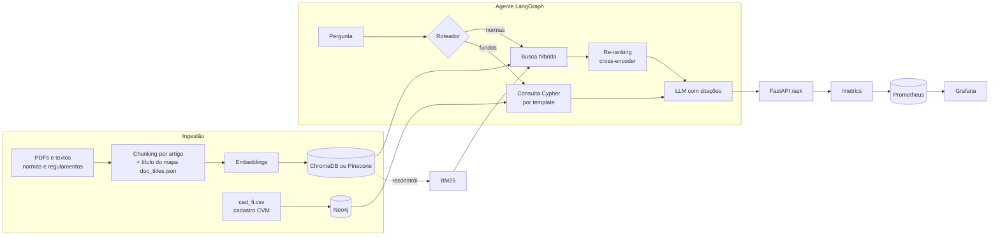

# FinRAG CVM

[](https://github.com/AbnerRidigolo/finrag-cvm/actions/workflows/ci.yml)


Assistente de perguntas e respostas sobre o mercado de fundos brasileiro, construído sobre **dados públicos da CVM**. Combina **RAG híbrido** (busca densa + BM25 + re-ranking) para normas e regulamentos com um **grafo de fundos no Neo4j** para perguntas sobre gestores e administradores. Um agente em **LangGraph** decide qual caminho usar, toda resposta vem com as fontes citadas, e latência e custo de cada pergunta são medidos e expostos para **Prometheus e Grafana**.

> **Problema.** Regulamentos de fundos e normas da CVM são longos, cheios de remissões e escritos em linguagem jurídica. Perguntas como *"qual a taxa de performance deste FIDC?"* ou *"quais fundos esta gestora administra?"* exigem ler dezenas de páginas ou cruzar planilhas do Portal de Dados Abertos. Este projeto responde em segundos, com a citação do artigo de onde a resposta saiu.

## Arquitetura



A busca híbrida consulta o ChromaDB (similaridade semântica) e um índice BM25 (termos exatos), funde os rankings com **Reciprocal Rank Fusion** e reordena os candidatos com um **cross-encoder** multilíngue antes de enviar o contexto ao LLM.

## Rodando em 2 minutos (sem chave de API)

O modo offline usa embeddings por hashing e um "LLM" extrativo que devolve o trecho mais relevante. Serve para ver o pipeline funcionando; para respostas de verdade, configure um provedor (seção seguinte).

Linux e macOS:

```bash
git clone https://github.com/AbnerRidigolo/finrag-cvm.git
cd finrag-cvm
python -m venv .venv && source .venv/bin/activate
pip install -e ".[dev]"
cp .env.example .env

make demo    # indexa o corpus de exemplo e faz uma pergunta
make eval    # compara denso x esparso x híbrido
make test    # testes com cobertura
```

Windows (PowerShell), onde o `make` normalmente não está disponível:

```powershell
git clone https://github.com/AbnerRidigolo/finrag-cvm.git
cd finrag-cvm
python -m venv .venv
.venv\Scripts\Activate.ps1
pip install -e ".[dev]"
Copy-Item .env.example .env

python -m finrag.pipeline index data/sample/docs
python -m finrag.pipeline ask "Qual é a taxa de administração do Fundo Exemplo Alpha?"
python -m finrag.eval.retrieval_eval data/eval/questions.jsonl
pytest --cov=finrag
```

Saída do `make demo`:

```
3 documentos -> 23 chunks indexados no chroma em 0.6s
[rota: normas]

Trecho mais relevante encontrado [1]:
(regulamento_fundo_exemplo_alpha.txt, Art.4º)
Art. 4º A taxa de administração é de 1,2% ao ano sobre o patrimônio líquido do fundo...

[1] REGULAMENTO DO FUNDO EXEMPLO ALPHA FIDC Art.4º (score 0.0325)
[2] REGULAMENTO DO FUNDO EXEMPLO ALPHA FIDC Art.1º (score 0.0315)
...
```

Toda resposta traz latência por etapa, tokens e custo estimado (no modo offline, zero).

## Configuração completa

```bash
pip install -e ".[all]"   # OpenAI, Anthropic, cross-encoder, Pinecone e driver Neo4j
```

No `.env`:

| Variável | Opções | Para quê |
| :-- | :-- | :-- |
| `LLM_PROVIDER` | `openai`, `anthropic`, `extractive` | Geração das respostas e roteamento |
| `LLM_MODEL` | nome do modelo do provedor | |
| `EMBEDDING_PROVIDER` | `openai`, `hashing` | Busca densa |
| `RERANKER` | `cross-encoder`, `none` | Re-ranking dos candidatos |
| `VECTOR_STORE` | `chroma`, `pinecone` | Banco vetorial (local ou gerenciado) |
| `CANDIDATES_PER_RETRIEVER` | inteiro, padrão 10 | Candidatos por método antes da fusão; o re-ranking lê até o dobro |
| `DOC_TITLES_PATH` | caminho, padrão `data/doc_titles.json` | Títulos e assuntos dos documentos |
| `GRAPH_ENABLED` | `true`, `false` | Ativa a rota de perguntas sobre fundos |
| `JUDGE_PROVIDER`, `JUDGE_MODEL` | provedor e modelo | LLM juiz da avaliação de respostas |
| `LLM_PRICES` | JSON `{"modelo": [entrada, saída]}` | Preço em USD por milhão de tokens, para o custo por pergunta |
| `OPENAI_API_KEY`, `ANTHROPIC_API_KEY`, `PINECONE_API_KEY` | chaves | Exportadas do `.env` para os SDKs pelos CLIs e pela API ao construir o agente; uma variável já definida no ambiente tem precedência |

Com Docker (API, Neo4j, Prometheus e Grafana):

```bash
make up                  # docker compose up -d --build
make graph-load          # carrega o cadastro de exemplo no grafo
curl -X POST localhost:8000/ask -H "Content-Type: application/json" \
     -d '{"question": "Quais fundos da gestora Alfa Capital?"}'
```

| Serviço | Endereço |
| :-- | :-- |
| API e documentação interativa | http://localhost:8000/docs |
| Métricas no formato Prometheus | http://localhost:8000/metrics/ |
| Prometheus | http://localhost:9090 |
| Grafana (dashboard FinRAG já provisionado) | http://localhost:3000 |
| Neo4j Browser | http://localhost:7474 |

## Dados reais da CVM

O repositório traz um **corpus de exemplo fictício** em `data/sample/`, usado nos testes e no CI. Para avaliar com dados reais:

1. **Documentos.** Baixe normas (por exemplo, a Resolução CVM 175 e seus anexos) na área de Legislação do site da CVM e regulamentos de fundos na consulta pública de fundos. Coloque os PDFs em `data/raw/docs/`, que está no `.gitignore`.

   O corpus usado nos resultados abaixo tem a Resolução CVM 175 consolidada, baixada por parte (Parte Geral e Anexos Normativos I a XII), e três regulamentos de FIDC já adaptados a ela, obtidos na consulta de fundos da CVM. Escolhas e limitações:
   - **Sem regulamento de FIP.** Não foi possível obter um regulamento de FIP adaptado à Resolução 175 em domínio da CVM; o tema está coberto só pelo Anexo Normativo IV. Regulamentos antigos (ICVM 578) foram descartados porque trariam regras revogadas.
   - **Suplementos excluídos.** O arquivo de Suplementos da Resolução 175 (lâminas, informes e formulários-modelo) gerava 179 trechos sem nenhum artigo, que não viram pergunta de avaliação mas competem na busca como ruído. Ele fica em `data/raw/excluded/`.
   - **O texto consolidado completo não é indexado**, só as partes, para não duplicar cada artigo.
   - **Redação revogada.** No PDF consolidado da CVM, a redação antiga aparece tachada logo antes da vigente, e o tachado se perde na extração de texto. Nos arquivos `resol*consolid*`, quando o mesmo artigo aparece em seções seguidas, o chunker mantém só a última (a vigente) e registra cada descarte no log da indexação. Na Resolução 175 foram 11 seções descartadas, todas conferidas à mão.
2. **Configuração.** No `.env`, use embeddings e reranker reais: `EMBEDDING_PROVIDER=openai`, `RERANKER=cross-encoder`, um `LLM_PROVIDER` real, um `JUDGE_PROVIDER` e os preços dos dois modelos em `LLM_PRICES`. Cada arquivo em `data/raw/docs/` precisa de uma entrada em `data/doc_titles.json`; os que faltarem geram aviso na indexação.
3. **Indexação.** `python -m finrag.pipeline index data/raw/docs`
4. **Dataset de avaliação.** `python -m finrag.eval.build_dataset data/eval/cvm_questions.jsonl -n 50` sorteia trechos e pede ao LLM uma pergunta que só aquele trecho responde. O trecho vira o gabarito. Detalhes:
   - **Amostragem igual por documento.** As perguntas são divididas igualmente entre os arquivos, então um anexo de 4 páginas tem o mesmo peso da Parte Geral, de 76. A escolha foi deliberada, para cobrir todos os tipos de fundo; o custo é que a métrica não reflete a proporção de cada documento no corpus.
   - **Perguntas citam o assunto.** O gerador recebe o `subject` do documento (por exemplo "Croma FIDC" ou "FII", em `data/doc_titles.json`) e deve citá-lo, como faria um usuário real, que pergunta "qual a taxa do Croma FIDC?" e não "qual a taxa do fundo?". Isso facilita a busca, porque o título do documento também está no cabeçalho indexado de cada trecho; é uma condição favorável, e a métrica deve ser lida sabendo disso.
   - **Cópia marcada automaticamente.** Perguntas que repetem 6 ou mais palavras seguidas do trecho (ignorando maiúsculas e acentos) recebem `"copied": true` e vão para o log. O filtro também pega terminologia sem paráfrase natural ("ações preferenciais sem direito a voto"), então a decisão final é da revisão manual.
   - **Revisão manual e lista de exclusão.** Perguntas ruins são removidas do arquivo e o trecho vai para `data/eval/excluded_chunks.txt`, com o motivo, para não ser regerado.
   - **Grava a cada pergunta.** Uma falha no meio (saldo, rede) não perde o que já foi pago; rodar de novo retoma de onde parou.

   Efeito do prompt revisado, contado nas 49 perguntas de cada versão (a primeira versão pedia só paráfrase e não recebia o assunto):

   | Problema | Prompt inicial | Prompt revisado |
   | :-- | --: | --: |
   | Não diz o fundo ou o tipo de fundo | 18 | 0 |
   | Cita a estrutura do documento (anexo, artigo, inciso) | 3 | 0 |
   | Depende de outro contexto | 8 | 2 |
   | Nome de fundo ou pessoa ausente do trecho | não verificado | 0 |
   | Marcada como copiada (6+ palavras seguidas) | não medido | 10 (4 cópias reais, 6 terminologia) |

   Após a revisão ficaram **43 perguntas**: saíram as 2 que dependiam de contexto e as 4 cópias reais.
5. **Recuperação.** `python -m finrag.eval.retrieval_eval data/eval/cvm_questions.jsonl --output data/eval/results/retrieval.md` compara denso, esparso, híbrido e híbrido + re-ranking, com latência p50 e p95.
6. **Respostas.** `python -m finrag.eval.answer_eval data/eval/cvm_questions.jsonl -n 30 --rejudge 10 --max-cost 0.35` avalia 30 perguntas, julga de novo 10 respostas e para antes de passar de US$ 0,35 (detalhes abaixo). Grava a cada pergunta e, se interrompido, retoma de onde parou somando o gasto anterior ao teto.
7. **Controle negativo do juiz.** `python -m finrag.eval.judge_control data/eval/results/answer_eval.jsonl --max-cost 0.12` julga versões deliberadamente erradas das respostas.

Os mesmos passos estão no `Makefile`: `index-real`, `dataset`, `eval-real`, `eval-answers` e `judge-control`.

Para o grafo de fundos, `python -m finrag.pipeline download-cadastro` baixa o `cad_fi.csv` do [Portal de Dados Abertos da CVM](https://dados.cvm.gov.br/dataset/fi-cad) e `python -m finrag.pipeline graph-load data/raw/cad_fi.csv` carrega no Neo4j. Atenção: esse arquivo cobre os fundos **não adaptados** à Resolução CVM 175; os adaptados estão em `registro_fundo_classe.zip`, ainda não suportado (ver próximos passos).

## Resultados

### Recuperação nos documentos reais da CVM

Corpus: Resolução CVM 175 (Parte Geral e Anexos Normativos I a XII) e três regulamentos de FIDC, **16 documentos e 1.578 trechos** (ver [Dados reais da CVM](#dados-reais-da-cvm)). Dataset: **43 perguntas sintéticas** geradas pelo `gpt-6-sol` e revisadas à mão, uma ou mais por documento. Embeddings `text-embedding-3-small`, re-ranking com o cross-encoder `mmarco-mMiniLMv2-L12-H384-v1` rodando em CPU, 20 candidatos por método, k = 5. Entre colchetes, o IC de 95% por bootstrap (1.000 reamostragens das perguntas, semente fixa); a latência inclui a chamada de rede à API de embeddings.

| Configuração | Hit@1 | Hit@5 | MRR@5 | p50 (ms) | p95 (ms) |
| :-- | --: | --: | --: | --: | --: |
| Denso | 0,65 [0,51–0,79] | 0,88 [0,77–0,98] | 0,75 [0,63–0,85] | 336 | 814 |
| Esparso (BM25) | 0,60 [0,47–0,74] | 0,84 [0,72–0,93] | 0,70 [0,58–0,81] | 3 | 4 |
| Híbrido (RRF) | 0,67 [0,53–0,81] | 0,88 [0,77–0,98] | 0,77 [0,65–0,87] | 320 | 428 |
| Híbrido + re-ranking | 0,81 [0,67–0,91] | 0,95 [0,88–1,00] | 0,87 [0,77–0,94] | 2.164 | 2.329 |

Diferença pareada (as mesmas perguntas reamostradas nos dois lados), IC de 95%:

| Comparação | Δ Hit@1 | Δ Hit@5 | Δ MRR@5 |
| :-- | --: | --: | --: |
| Híbrido − Denso | +0,02 [−0,09 a +0,16] | +0,00 [−0,09 a +0,09] | +0,02 [−0,07 a +0,11] |
| Híbrido − BM25 | +0,07 [−0,02 a +0,19] | +0,05 [−0,05 a +0,14] | +0,07 [+0,00 a +0,14] |
| Re-ranking − Híbrido | +0,14 [+0,00 a +0,26] | +0,07 [+0,00 a +0,16] | +0,10 [+0,01 a +0,19] |

**Leitura.** O re-ranking melhorou o MRR (+0,10, IC 95% +0,01 a +0,19); no Hit@1 a melhora estimada é de +0,14, mas o intervalo encosta no zero (+0,00 a +0,26), então com 43 perguntas o tamanho do ganho é incerto. O custo é de latência: o p50 passou de 320 ms para 2.164 ms com o cross-encoder em CPU. **O híbrido não superou o denso** neste dataset: a diferença é de +0,02 no Hit@1, com IC de −0,09 a +0,16. Uma hipótese, não testada, é que as perguntas citam o fundo ou o tipo de fundo, que também está no cabeçalho indexado de cada trecho, e isso favorece igualmente o denso e o BM25, reduzindo o espaço para a fusão complementar os dois. Contra o BM25 sozinho, o híbrido tem vantagem pequena e no limite (MRR +0,07, IC +0,00 a +0,14).

**10 ou 20 candidatos por método.** Com re-ranking, reduzir de 20 para 10 candidatos não mudou o resultado de nenhuma das 43 perguntas (diferença pareada de 0,00 nas três métricas) e baixou o p50 de 2.555 ms para 1.423 ms na mesma execução, porque o cross-encoder passa a ler em média 16,6 trechos em vez de 33,7. Sem re-ranking, 5 perguntas mudaram, com diferença dentro da margem (Hit@5 +0,05, IC +0,00 a +0,12). Por isso o padrão de `CANDIDATES_PER_RETRIEVER` passou de 20 para 10 (a tabela acima foi medida com 20), e a avaliação de respostas abaixo usa 10. A equivalência vale para este dataset; com perguntas mais difíceis, um trecho relevante fora dos 10 primeiros de cada método passaria a ser perdido.

Ressalvas: perguntas sintéticas, uma única rodada, 43 perguntas, e a amostragem dá o mesmo peso a documentos de tamanhos muito diferentes.

### Avaliação das respostas (LLM como juiz)

A recuperação pode acertar e a resposta ainda alucinar. Por isso há uma segunda avaliação, em que outro LLM julga cada resposta:

- **Fidelidade (1 a 5):** toda afirmação está sustentada pelo contexto recuperado? Dizer "o contexto não informa" conta como fiel.
- **Relevância (1 a 5):** a resposta atende ao que foi perguntado?

O juiz recebe critérios com âncoras por nota, escreve a justificativa antes da nota e, no Claude, roda com thinking desativado. Os modelos atuais não aceitam `temperature=0` (o juiz não tem amostragem configurável), então as notas podem variar entre execuções. Use um modelo diferente do gerador (`JUDGE_PROVIDER` e `JUDGE_MODEL`), para reduzir o viés de um modelo avaliar a si mesmo. O script imprime fidelidade e relevância médias, a fração de respostas fiéis, a latência média e o custo separado em `custo_agente_usd` (o que as perguntas custariam em produção), `custo_juiz_usd` (custo só da avaliação) e `custo_total_usd`, a concordância do rejulgamento (`--rejudge`), se a rodada foi interrompida (por custo ou por 3 falhas seguidas do juiz) e os piores casos para revisão manual. Um 400 genérico da API ganha uma nova tentativa; o prompt de cada chamada que falha fica em `data/eval/results/failed_requests/`, fora do git. O detalhe por pergunta fica em `data/eval/results/answer_eval.jsonl`.

**Gerador e juiz são do mesmo provedor, com modelos diferentes.** Nos resultados publicados, as respostas vêm do `gpt-6-luna` e o juiz é o `gpt-6-sol`, mais forte, ambos da OpenAI. O ideal seria um juiz de outro provedor, porque modelos da mesma família tendem a compartilhar vieses e podem avaliar com mais boa vontade respostas no próprio estilo. O código já suporta isso: basta definir `JUDGE_PROVIDER=anthropic` e `JUDGE_MODEL` no `.env`, sem mudar nada no código.

**O mesmo modelo gera as perguntas e julga as respostas.** O `build_dataset` usa o modelo do juiz para escrever as perguntas sintéticas. Isso é aceitável aqui porque as duas tarefas não se contaminam: o juiz não avalia a pergunta, e sim se a resposta *de outro modelo* está sustentada pelo contexto recuperado, comparando dois textos que ele recebe no prompt. O viés que importa evitar é o do gerador corrigir a si mesmo, e esse continua evitado. O risco que sobra é o modelo escrever perguntas no próprio estilo e depois achar mais "relevantes" as respostas que combinam com ele. Por isso as perguntas são revisadas à mão antes da avaliação, e a relevância deve ser lida com mais cautela que a fidelidade.

#### Resultados nos documentos reais

As 30 primeiras perguntas do dataset (de 43, limite escolhido por custo), com o agente completo: roteador e resposta pelo `gpt-6-luna`, busca híbrida com 10 candidatos por método e re-ranking, 5 trechos no contexto. Juiz: `gpt-6-sol`. Detalhe por pergunta, com o contexto que o juiz leu, em `data/eval/results/answer_eval.jsonl`.

| Métrica | Resultado |
| :-- | :-- |
| Fidelidade média | 5,00 (nota 5 nas 30 respostas) |
| Relevância média | 4,93 (29 com nota 5, 1 com nota 3) |
| Trecho do gabarito entre as 5 fontes recuperadas | 29 de 30 |
| Rejulgamento de 10 respostas | mesma nota nas 10, em fidelidade e em relevância |
| Custo do agente por pergunta | US$ 0,00025 |
| Latência do agente | p50 de 5,2 s (máximo de 8,2 s) |
| Custo da avaliação | US$ 0,178, quase todo do juiz (US$ 0,128 + US$ 0,042 do rejulgamento) |

**Ressalva: as notas estão no teto.** Com nota 5 em todas as respostas, a fidelidade não discrimina nada nesta amostra, e a concordância do rejulgamento também diz pouco: repetir 5 onde tudo é 5 não mostra consistência em casos difíceis. Duas explicações são compatíveis com esse resultado, perguntas fáceis (sintéticas, citando o assunto, com o gabarito recuperado em 29 de 30) ou um juiz leniente. O controle negativo abaixo testa a segunda.

**Controle negativo do juiz.** Respostas reais da amostra do rejulgamento foram alteradas de forma determinística, sem LLM, mantendo a pergunta e o contexto (`python -m finrag.eval.judge_control`). Um juiz útil precisa dar nota baixa a elas.

| Perturbação | Respostas | Notas de fidelidade | Notas de relevância | Critério de detecção | Detectadas |
| :-- | --: | :-- | :-- | :-- | --: |
| Números e prazos dobrados (só respostas com número) | 3 | 1 (×3) | 5 (×3) | fidelidade ≤ 3 | 3 de 3 |
| Resposta de outra pergunta | 10 | 1 (×10) | 1 (×10) | relevância ≤ 3 | 10 de 10 |
| Frase plausível inventada, ausente do contexto | 10 | 3 (×9), 1 (×1) | 5 (×10) | fidelidade ≤ 3 | 10 de 10 |

Custo: US$ 0,105. O juiz reconheceu todos os erros, e separou bem os dois critérios: resposta trocada derrubou a relevância, números alterados e frase inventada derrubaram só a fidelidade. Mas a frase inventada foi detectada **no limite**: 9 das 10 respostas receberam nota 3, que é a âncora da rubrica para "mistura afirmações sustentadas com uma não sustentada". Com um critério mais rígido (fidelidade ≤ 2), a detecção cairia para 1 de 10. Na prática, uma afirmação sem apoio no meio de uma resposta correta tira a resposta do grupo "fiel" (nota ≥ 4), mas não a leva ao fundo da escala. A perturbação de números teve só 3 casos, porque 7 das 10 respostas da amostra não tinham números; é pouco para concluir sobre ela.

**Fidelidade não é correção.** Na pergunta "Nos fundos de investimento em geral, é possível realizar uma assembleia sem convocação prévia se todos os cotistas comparecerem?", a regra está na Parte Geral da Resolução 175, mas a busca trouxe trechos dos regulamentos de FIDC, e é esse o único caso em que o gabarito não foi recuperado. A resposta se apoiou nesses regulamentos e ainda ressalvou que o contexto não permitia estender a regra a todos os fundos. O juiz deu nota 5, e pela rubrica está certo: tudo o que a resposta afirma está no contexto que ela recebeu. O erro foi da recuperação, e a fidelidade, por construção, não o enxerga. Por isso a taxa de recuperação do gabarito (29 de 30) deve ser lida junto com a fidelidade.

### Corpus de exemplo (teste do encanamento)

`make eval` roda a avaliação de recuperação no corpus fictício de `data/sample/` (10 perguntas com o artigo correto anotado), com embeddings por hashing e sem re-ranking. Serve para verificar que o pipeline funciona sem chave de API, não para medir qualidade semântica:

| Configuração | Hit@1 | Hit@5 | MRR@5 |
| :-- | --: | --: | --: |
| Denso | 0,70 [0,50–1,00] | 1,00 [1,00–1,00] | 0,82 [0,66–1,00] |
| Esparso (BM25) | 0,70 [0,40–0,90] | 1,00 [1,00–1,00] | 0,85 [0,70–0,95] |
| Híbrido (RRF) | 0,80 [0,60–1,00] | 1,00 [1,00–1,00] | 0,88 [0,72–1,00] |

Com 10 perguntas, os intervalos se sobrepõem quase por inteiro, e nenhuma configuração se destaca.

## Decisões técnicas

**Chunking por artigo.** Textos normativos são organizados em artigos, e cortar um artigo ao meio separa a regra das exceções. O chunker divide por artigo e só quebra artigos que passam do limite, preferindo fim de frase e mantendo sobreposição.

**Título do documento no texto indexado.** O primeiro teste de recuperação falhou: o Art. 4º ("A taxa de administração é de 1,2%...") não menciona o nome do fundo, então perdia para artigos que só citavam o nome. Cada trecho passou a ser indexado com o título do documento e o número do artigo como cabeçalho (*contextual chunk headers*), mantendo o texto original para exibição.

**Títulos por mapa explícito, não pela primeira linha.** A primeira versão usava a primeira linha do arquivo como título. No corpus fictício, em que cada arquivo começa pelo nome do fundo, funcionava. Nos PDFs reais, a primeira linha era timbre ou número de página: todos os 13 arquivos da Resolução 175 viravam "COMISSÃO DE VALORES MOBILIÁRIOS", e os regulamentos, "REGULAMENTO DO", "REGULAMENTO" e "1". O cabeçalho indexado não distinguia um anexo de outro, e o gerador de perguntas não tinha de onde tirar o nome do fundo, que aparece no texto de só 2% a 4% dos trechos dos regulamentos. Os títulos passaram a vir de `data/doc_titles.json`, com dois campos por arquivo: `title` (completo, extraído do cabeçalho do documento, vai no texto indexado e nas fontes) e `subject` (curto, é o que a pergunta sintética cita). Um arquivo indexado fora do mapa gera aviso no log e cai no comportamento antigo. A lição: heurística validada só no corpus de exemplo não diz nada sobre o corpus real.

**Busca híbrida com RRF.** Embeddings capturam paráfrases ("quanto custa o fundo" e "taxa de administração"), mas diluem termos exatos como "Art. 6º", "FIDC" ou um CNPJ, que o BM25 acerta. O RRF combina os rankings pela posição, sem precisar calibrar escalas de score diferentes.

**Re-ranking só nos candidatos.** O cross-encoder lê pergunta e trecho juntos e é mais preciso, mas é caro. Ele só roda sobre os candidatos da fusão: com N candidatos por método, até 2N trechos (em média 33,7 com N = 20 e 16,6 com N = 10 no corpus real), por isso N controla diretamente a latência.

**BM25 reconstruído a partir do Chroma.** O Chroma é a fonte única de verdade dos chunks; o índice BM25 é recriado dele na inicialização. Isso evita dois índices dessincronizados.

**Cypher por template, não gerado pelo LLM.** Text-to-Cypher é flexível, mas pode gerar consultas erradas ou caras. O LLM só classifica a intenção e extrai a entidade; a consulta é um template parametrizado, previsível e sem risco de injeção.

**Banco vetorial atrás de um protocolo.** O retriever híbrido depende só de `VectorStore` (`add`, `search`, `all_chunks`). Chroma embarcado é o padrão para desenvolvimento; Pinecone serverless é a opção gerenciada para produção, trocada por `VECTOR_STORE=pinecone`. No Pinecone, o texto do chunk vai nos metadados, o ID é um hash ASCII do ID original (que pode ter acentos) e o BM25 é reconstruído com `list` + `fetch` paginados.

**Custo e latência como parte da resposta.** Cada etapa do agente é cronometrada e cada chamada ao LLM devolve os tokens usados. Isso vai para o campo `usage` da resposta e para o Prometheus (`finrag_request_latency_seconds`, `finrag_stage_latency_seconds`, `finrag_llm_tokens_total`, `finrag_llm_cost_usd_total`). Os preços ficam na configuração, não no código, porque mudam; chamadas a modelos sem preço aparecem em `finrag_llm_unpriced_calls_total` em vez de virarem custo zero silencioso.

**Degradação graciosa.** Se o LLM não devolver JSON válido no roteamento, o agente usa regras. Se o grafo estiver desligado, perguntas sobre fundos caem na busca em documentos. Sem chave de API, o projeto ainda roda no modo extrativo.

## Estrutura

```
src/finrag/
├── ingestion/     loaders (PDF, texto), mapa de títulos e chunking por artigo
├── retrieval/     embeddings, Chroma, Pinecone, BM25, RRF, re-ranking, retriever híbrido
├── graph/         leitura do cadastro CVM e grafo Neo4j
├── eval/          geração de dataset, recuperação com IC, LLM como juiz e controle negativo
├── agent.py       agente LangGraph (roteia, recupera, responde, mede)
├── llm.py         provedores OpenAI, Anthropic e modo offline, com contagem de tokens
├── metrics.py     métricas Prometheus e custo por pergunta
├── api.py         FastAPI
└── pipeline.py    CLI: index, ask, download-cadastro, graph-load
monitoring/        Prometheus e dashboard do Grafana provisionado
data/doc_titles.json          título e assunto de cada documento
data/eval/cvm_questions.jsonl dataset revisado (43 perguntas) e excluded_chunks.txt
data/eval/results/            resultados publicados das avaliações
```

## Próximos passos

- [x] Avaliação sobre documentos reais com re-ranking
- [x] Avaliação da qualidade das respostas com LLM como juiz
- [x] Adaptador para Pinecone como alternativa ao Chroma
- [x] Métricas de latência e custo por pergunta no Prometheus, com dashboard no Grafana
- [x] Publicar os resultados sobre documentos reais da CVM
- [ ] Suporte ao `registro_fundo_classe.zip` (fundos adaptados à Resolução CVM 175) no grafo
- [ ] Calibrar o juiz comparando suas notas com uma amostra avaliada à mão (o controle negativo testa só erros introduzidos de propósito)
- [ ] Avaliar com perguntas mais difíceis ou reais, que tirem a fidelidade do teto
- [ ] Alerta no Prometheus para p95 de latência e custo por pergunta acima de um limite
- [ ] Remover na normalização os 71 marcadores de lista U+F0B7 (fonte Symbol, área de uso privado) que a extração dos PDFs da Resolução 175 deixa no texto. Exige reindexar e muda os `chunk_id`, então o dataset precisa ser remapeado junto.

## Licença

MIT. Os documentos de exemplo em `data/sample/` são fictícios e não representam regulamentos reais nem texto oficial da CVM.
