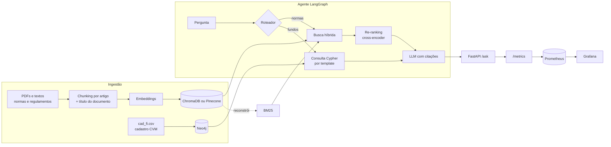

# FinRAG CVM

[](https://github.com/AbnerRidigolo/finrag-cvm/actions/workflows/ci.yml)


Assistente de perguntas e respostas sobre o mercado de fundos brasileiro, construído sobre **dados públicos da CVM**. Combina **RAG híbrido** (busca densa + BM25 + re-ranking) para normas e regulamentos com um **grafo de fundos no Neo4j** para perguntas sobre gestores e administradores. Um agente em **LangGraph** decide qual caminho usar, toda resposta vem com as fontes citadas, e latência e custo de cada pergunta são medidos e expostos para **Prometheus e Grafana**.

> **Problema.** Regulamentos de fundos e normas da CVM são longos, cheios de remissões e escritos em linguagem jurídica. Perguntas como *"qual a taxa de performance deste FIDC?"* ou *"quais fundos esta gestora administra?"* exigem ler dezenas de páginas ou cruzar planilhas do Portal de Dados Abertos. Este projeto responde em segundos, com a citação do artigo de onde a resposta saiu.

## Arquitetura



A busca híbrida consulta o ChromaDB (similaridade semântica) e um índice BM25 (termos exatos) em paralelo, funde os rankings com **Reciprocal Rank Fusion** e reordena os candidatos com um **cross-encoder** multilíngue antes de enviar o contexto ao LLM.

## Rodando em 2 minutos (sem chave de API)

O modo offline usa embeddings por hashing e um "LLM" extrativo que devolve o trecho mais relevante. Serve para ver o pipeline funcionando; para respostas de verdade, configure um provedor (seção seguinte).

Linux e macOS:

```bash
git clone https://github.com/AbnerRidigolo/finrag-cvm.git
cd finrag-cvm
python -m venv .venv && source .venv/bin/activate
pip install -e ".[dev]"
cp .env.example .env

make demo    # indexa o corpus de exemplo e faz uma pergunta
make eval    # compara denso x esparso x híbrido
make test    # testes com cobertura
```

Windows (PowerShell), onde o `make` normalmente não está disponível:

```powershell
git clone https://github.com/AbnerRidigolo/finrag-cvm.git
cd finrag-cvm
python -m venv .venv
.venv\Scripts\Activate.ps1
pip install -e ".[dev]"
Copy-Item .env.example .env

python -m finrag.pipeline index data/sample/docs
python -m finrag.pipeline ask "Qual é a taxa de administração do Fundo Exemplo Alpha?"
python -m finrag.eval.retrieval_eval data/eval/questions.jsonl
pytest --cov=finrag
```

Saída do `make demo`:

```
3 documentos -> 23 chunks indexados em 0.1s
[rota: normas]

Trecho mais relevante encontrado [1]:
(regulamento_fundo_exemplo_alpha.txt, Art.4º)
Art. 4º A taxa de administração é de 1,2% ao ano sobre o patrimônio líquido do fundo...
```

Toda resposta traz latência por etapa, tokens e custo estimado (no modo offline, zero).

## Configuração completa

```bash
pip install -e ".[all]"   # OpenAI, Anthropic, cross-encoder e driver Neo4j
```

No `.env`:

| Variável | Opções | Para quê |
| :-- | :-- | :-- |
| `LLM_PROVIDER` | `openai`, `anthropic`, `extractive` | Geração das respostas e roteamento |
| `LLM_MODEL` | nome do modelo do provedor | |
| `EMBEDDING_PROVIDER` | `openai`, `hashing` | Busca densa |
| `RERANKER` | `cross-encoder`, `none` | Re-ranking dos candidatos |
| `VECTOR_STORE` | `chroma`, `pinecone` | Banco vetorial (local ou gerenciado) |
| `GRAPH_ENABLED` | `true`, `false` | Ativa a rota de perguntas sobre fundos |
| `JUDGE_PROVIDER`, `JUDGE_MODEL` | provedor e modelo | LLM juiz da avaliação de respostas |
| `LLM_PRICES` | JSON `{"modelo": [entrada, saída]}` | Preço em USD por milhão de tokens, para o custo por pergunta |

Com Docker (API, Neo4j, Prometheus e Grafana):

```bash
make up                  # docker compose up -d --build
make graph-load          # carrega o cadastro de exemplo no grafo
curl -X POST localhost:8000/ask -H "Content-Type: application/json" \
     -d '{"question": "Quais fundos da gestora Alfa Capital?"}'
```

| Serviço | Endereço |
| :-- | :-- |
| API e documentação interativa | http://localhost:8000/docs |
| Métricas no formato Prometheus | http://localhost:8000/metrics/ |
| Prometheus | http://localhost:9090 |
| Grafana (dashboard FinRAG já provisionado) | http://localhost:3000 |
| Neo4j Browser | http://localhost:7474 |

## Dados reais da CVM

O repositório traz um **corpus de exemplo fictício** em `data/sample/`, usado nos testes e no CI. Para avaliar com dados reais:

1. **Documentos.** Baixe normas (por exemplo, a Resolução CVM 175 e seus anexos) na área de Legislação do site da CVM e regulamentos de fundos na consulta pública de fundos. Coloque os PDFs em `data/raw/docs/`, que está no `.gitignore`.
2. **Configuração.** No `.env`, use embeddings e reranker reais: `EMBEDDING_PROVIDER=openai`, `RERANKER=cross-encoder`, um `LLM_PROVIDER` real e um `JUDGE_PROVIDER`.
3. **Indexação.** `python -m finrag.pipeline index data/raw/docs`
4. **Dataset de avaliação.** `python -m finrag.eval.build_dataset data/eval/cvm_questions.jsonl -n 50` sorteia trechos de forma estratificada por documento e pede ao LLM uma pergunta que só aquele trecho responde. O trecho vira o gabarito. Revise uma amostra à mão: perguntas sintéticas tendem a repetir palavras do texto, o que favorece o BM25.
5. **Recuperação.** `python -m finrag.eval.retrieval_eval data/eval/cvm_questions.jsonl --output data/eval/results/retrieval.md` compara denso, esparso, híbrido e híbrido + re-ranking, com latência p50 e p95.
6. **Respostas.** `python -m finrag.eval.answer_eval data/eval/cvm_questions.jsonl -n 30` (detalhes abaixo).

Para o grafo de fundos, `python -m finrag.pipeline download-cadastro` baixa o `cad_fi.csv` do [Portal de Dados Abertos da CVM](https://dados.cvm.gov.br/dataset/fi-cad) e `python -m finrag.pipeline graph-load data/raw/cad_fi.csv` carrega no Neo4j. Atenção: esse arquivo cobre os fundos **não adaptados** à Resolução CVM 175; os adaptados estão em `registro_fundo_classe.zip`, ainda não suportado (ver próximos passos).

## Resultados

Avaliação de recuperação em `data/eval/questions.jsonl` (10 perguntas com o artigo correto anotado), gerada por `make eval`:

| Configuração | Hit@1 | Hit@5 | MRR@5 |
| :-- | --: | --: | --: |
| Denso | 0,70 | 1,00 | 0,82 |
| Esparso (BM25) | 0,70 | 1,00 | 0,85 |
| **Híbrido (RRF)** | **0,80** | 1,00 | **0,88** |

Esses números usam o corpus fictício e embeddings por hashing, então medem o encanamento, não a qualidade semântica.

**TODO — documentos reais da CVM:** colar aqui a tabela gerada em `data/eval/results/retrieval.md` (com a linha "híbrido + re-ranking" e as latências) e o resumo da avaliação de respostas.

### Avaliação das respostas (LLM como juiz)

A recuperação pode acertar e a resposta ainda alucinar. Por isso há uma segunda avaliação, em que outro LLM julga cada resposta:

- **Fidelidade (1 a 5):** toda afirmação está sustentada pelo contexto recuperado? Dizer "o contexto não informa" conta como fiel.
- **Relevância (1 a 5):** a resposta atende ao que foi perguntado?

O juiz recebe critérios com âncoras por nota, escreve a justificativa antes da nota e roda com temperatura zero. Use um modelo diferente do gerador (`JUDGE_PROVIDER`), para reduzir o viés de um modelo avaliar a si mesmo. O script imprime fidelidade e relevância médias, a fração de respostas fiéis, latência e custo médios, e lista os piores casos para revisão manual. O detalhe por pergunta fica em `data/eval/results/answer_eval.jsonl`.

## Decisões técnicas

**Chunking por artigo.** Textos normativos são organizados em artigos, e cortar um artigo ao meio separa a regra das exceções. O chunker divide por artigo e só quebra artigos que passam do limite, preferindo fim de frase e mantendo sobreposição.

**Título do documento no texto indexado.** O primeiro teste de recuperação falhou: o Art. 4º ("A taxa de administração é de 1,2%...") não menciona o nome do fundo, então perdia para artigos que só citavam o nome. Cada trecho passou a ser indexado com o título do documento e o número do artigo como cabeçalho (*contextual chunk headers*), mantendo o texto original para exibição.

**Busca híbrida com RRF.** Embeddings capturam paráfrases ("quanto custa o fundo" e "taxa de administração"), mas diluem termos exatos como "Art. 6º", "FIDC" ou um CNPJ, que o BM25 acerta. O RRF combina os rankings pela posição, sem precisar calibrar escalas de score diferentes.

**Re-ranking só nos candidatos.** O cross-encoder lê pergunta e trecho juntos e é mais preciso, mas é caro. Ele só roda sobre os ~20 candidatos da fusão.

**BM25 reconstruído a partir do Chroma.** O Chroma é a fonte única de verdade dos chunks; o índice BM25 é recriado dele na inicialização. Isso evita dois índices dessincronizados.

**Cypher por template, não gerado pelo LLM.** Text-to-Cypher é flexível, mas pode gerar consultas erradas ou caras. O LLM só classifica a intenção e extrai a entidade; a consulta é um template parametrizado, previsível e sem risco de injeção.

**Banco vetorial atrás de um protocolo.** O retriever híbrido depende só de `VectorStore` (`add`, `search`, `all_chunks`). Chroma embarcado é o padrão para desenvolvimento; Pinecone serverless é a opção gerenciada para produção, trocada por `VECTOR_STORE=pinecone`. No Pinecone, o texto do chunk vai nos metadados, o ID é um hash ASCII do ID original (que pode ter acentos) e o BM25 é reconstruído com `list` + `fetch` paginados.

**Custo e latência como parte da resposta.** Cada etapa do agente é cronometrada e cada chamada ao LLM devolve os tokens usados. Isso vai para o campo `usage` da resposta e para o Prometheus (`finrag_request_latency_seconds`, `finrag_stage_latency_seconds`, `finrag_llm_tokens_total`, `finrag_llm_cost_usd_total`). Os preços ficam na configuração, não no código, porque mudam; chamadas a modelos sem preço aparecem em `finrag_llm_unpriced_calls_total` em vez de virarem custo zero silencioso.

**Degradação graciosa.** Se o LLM não devolver JSON válido no roteamento, o agente usa regras. Se o grafo estiver desligado, perguntas sobre fundos caem na busca em documentos. Sem chave de API, o projeto ainda roda no modo extrativo.

## Estrutura

```
src/finrag/
├── ingestion/     loaders (PDF, texto) e chunking por artigo
├── retrieval/     embeddings, Chroma, Pinecone, BM25, RRF, re-ranking, retriever híbrido
├── graph/         leitura do cadastro CVM e grafo Neo4j
├── eval/          geração de dataset, avaliação de recuperação e LLM como juiz
├── agent.py       agente LangGraph (roteia, recupera, responde, mede)
├── llm.py         provedores OpenAI, Anthropic e modo offline, com contagem de tokens
├── metrics.py     métricas Prometheus e custo por pergunta
├── api.py         FastAPI
└── pipeline.py    CLI: index, ask, download-cadastro, graph-load
monitoring/        Prometheus e dashboard do Grafana provisionado
```

## Próximos passos

- [x] Avaliação sobre documentos reais com re-ranking (ferramental pronto; falta publicar os números)
- [x] Avaliação da qualidade das respostas com LLM como juiz
- [x] Adaptador para Pinecone como alternativa ao Chroma
- [x] Métricas de latência e custo por pergunta no Prometheus, com dashboard no Grafana
- [ ] Publicar os resultados sobre documentos reais da CVM
- [ ] Suporte ao `registro_fundo_classe.zip` (fundos adaptados à Resolução CVM 175) no grafo
- [ ] Calibrar o juiz comparando suas notas com uma amostra avaliada à mão
- [ ] Alerta no Prometheus para p95 de latência e custo por pergunta acima de um limite

## Licença

MIT. Os documentos de exemplo em `data/sample/` são fictícios e não representam regulamentos reais nem texto oficial da CVM.
