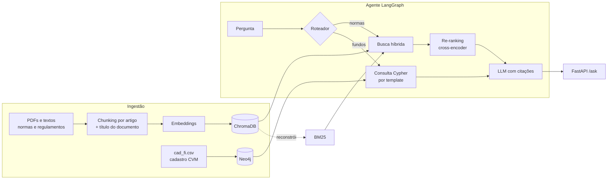

# FinRAG CVM

[](https://github.com/AbnerRidigolo/finrag-cvm/actions/workflows/ci.yml)


Assistente de perguntas e respostas sobre o mercado de fundos brasileiro, construído sobre **dados públicos da CVM**. Combina **RAG híbrido** (busca densa + BM25 + re-ranking) para normas e regulamentos com um **grafo de fundos no Neo4j** para perguntas sobre gestores e administradores. Um agente em **LangGraph** decide qual caminho usar, e toda resposta vem com as fontes citadas.

> **Problema.** Regulamentos de fundos e normas da CVM são longos, cheios de remissões e escritos em linguagem jurídica. Perguntas como *"qual a taxa de performance deste FIDC?"* ou *"quais fundos esta gestora administra?"* exigem ler dezenas de páginas ou cruzar planilhas do Portal de Dados Abertos. Este projeto responde em segundos, com a citação do artigo de onde a resposta saiu.

## Arquitetura



A busca híbrida consulta o ChromaDB (similaridade semântica) e um índice BM25 (termos exatos) em paralelo, funde os rankings com **Reciprocal Rank Fusion** e reordena os candidatos com um **cross-encoder** multilíngue antes de enviar o contexto ao LLM.

## Rodando em 2 minutos (sem chave de API)

O modo offline usa embeddings por hashing e um "LLM" extrativo que devolve o trecho mais relevante. Serve para ver o pipeline funcionando; para respostas de verdade, configure um provedor (seção seguinte).

```bash
git clone https://github.com/AbnerRidigolo/finrag-cvm.git
cd finrag-cvm
python -m venv .venv && source .venv/bin/activate
pip install -e ".[dev]"
cp .env.example .env

make demo    # indexa o corpus de exemplo e faz uma pergunta
make eval    # compara denso x esparso x híbrido
make test    # testes com cobertura
```

Saída do `make demo`:

```
3 documentos -> 23 chunks indexados em 0.1s
[rota: normas]

Trecho mais relevante encontrado [1]:
(regulamento_fundo_exemplo_alpha.txt, Art.4º)
Art. 4º A taxa de administração é de 1,2% ao ano sobre o patrimônio líquido do fundo...
```

## Configuração completa

```bash
pip install -e ".[all]"   # OpenAI, Anthropic, cross-encoder e driver Neo4j
```

No `.env`:

| Variável | Opções | Para quê |
| :-- | :-- | :-- |
| `LLM_PROVIDER` | `openai`, `anthropic`, `extractive` | Geração das respostas e roteamento |
| `LLM_MODEL` | nome do modelo do provedor | |
| `EMBEDDING_PROVIDER` | `openai`, `hashing` | Busca densa |
| `RERANKER` | `cross-encoder`, `none` | Re-ranking dos candidatos |
| `GRAPH_ENABLED` | `true`, `false` | Ativa a rota de perguntas sobre fundos |

Com Docker (API + Neo4j):

```bash
make up                  # sobe Neo4j e a API em http://localhost:8000
make graph-load          # carrega o cadastro de exemplo no grafo
curl -X POST localhost:8000/ask -H "Content-Type: application/json" \
     -d '{"question": "Quais fundos da gestora Alfa Capital?"}'
```

A documentação interativa da API fica em `http://localhost:8000/docs`.

## Dados

O repositório traz um **corpus de exemplo fictício** em `data/sample/` (regulamentos inventados e um cadastro no formato da CVM), usado nos testes e no CI. Para usar dados reais:

1. **Documentos:** baixe normas (por exemplo, a Resolução CVM 175 e seus anexos) e regulamentos de fundos no site da CVM e coloque os PDFs em `data/raw/`. Depois rode `python -m finrag.pipeline index data/raw`.
2. **Cadastro de fundos:** baixe o `cad_fi.csv` no [Portal de Dados Abertos da CVM](https://dados.cvm.gov.br/) e rode `python -m finrag.pipeline graph-load caminho/cad_fi.csv`. O leitor valida as colunas esperadas e falha com mensagem clara se a CVM mudar o layout.

## Resultados

Avaliação de recuperação em `data/eval/questions.jsonl` (10 perguntas com o artigo correto anotado), gerada por `make eval`:

| Configuração | Hit@1 | Hit@5 | MRR@5 |
| :-- | --: | --: | --: |
| Denso | 0,70 | 1,00 | 0,82 |
| Esparso (BM25) | 0,70 | 1,00 | 0,85 |
| **Híbrido (RRF)** | **0,80** | 1,00 | **0,88** |

Esses números usam o corpus fictício e embeddings por hashing, então medem o encanamento, não a qualidade semântica. **TODO:** substituir pela avaliação sobre documentos reais da CVM com `text-embedding-3-small` e cross-encoder, incluindo a linha "híbrido + re-ranking".

## Decisões técnicas

**Chunking por artigo.** Textos normativos são organizados em artigos, e cortar um artigo ao meio separa a regra das exceções. O chunker divide por artigo e só quebra artigos que passam do limite, preferindo fim de frase e mantendo sobreposição.

**Título do documento no texto indexado.** O primeiro teste de recuperação falhou: o Art. 4º ("A taxa de administração é de 1,2%...") não menciona o nome do fundo, então perdia para artigos que só citavam o nome. Cada trecho passou a ser indexado com o título do documento e o número do artigo como cabeçalho (*contextual chunk headers*), mantendo o texto original para exibição.

**Busca híbrida com RRF.** Embeddings capturam paráfrases ("quanto custa o fundo" e "taxa de administração"), mas diluem termos exatos como "Art. 6º", "FIDC" ou um CNPJ, que o BM25 acerta. O RRF combina os rankings pela posição, sem precisar calibrar escalas de score diferentes.

**Re-ranking só nos candidatos.** O cross-encoder lê pergunta e trecho juntos e é mais preciso, mas é caro. Ele só roda sobre os ~20 candidatos da fusão.

**BM25 reconstruído a partir do Chroma.** O Chroma é a fonte única de verdade dos chunks; o índice BM25 é recriado dele na inicialização. Isso evita dois índices dessincronizados.

**Cypher por template, não gerado pelo LLM.** Text-to-Cypher é flexível, mas pode gerar consultas erradas ou caras. O LLM só classifica a intenção e extrai a entidade; a consulta é um template parametrizado, previsível e sem risco de injeção.

**Degradação graciosa.** Se o LLM não devolver JSON válido no roteamento, o agente usa regras. Se o grafo estiver desligado, perguntas sobre fundos caem na busca em documentos. Sem chave de API, o projeto ainda roda no modo extrativo.

## Estrutura

```
src/finrag/
├── ingestion/     loaders (PDF, texto) e chunking por artigo
├── retrieval/     embeddings, Chroma, BM25, RRF, re-ranking, retriever híbrido
├── graph/         leitura do cadastro CVM e grafo Neo4j
├── eval/          avaliação de recuperação (Hit@k, MRR)
├── agent.py       agente LangGraph (roteia, recupera, responde)
├── llm.py         provedores OpenAI, Anthropic e modo offline
├── api.py         FastAPI
└── pipeline.py    CLI: index, ask, graph-load
```

## Próximos passos

- [ ] Avaliação sobre documentos reais da CVM, com re-ranking
- [ ] Avaliação da qualidade das respostas (fidelidade ao contexto e relevância) com LLM como juiz
- [ ] Adaptador para Pinecone como alternativa ao Chroma em produção
- [ ] Métricas de latência e custo por pergunta no Prometheus

## Licença

MIT. Os documentos de exemplo em `data/sample/` são fictícios e não representam regulamentos reais nem texto oficial da CVM.
